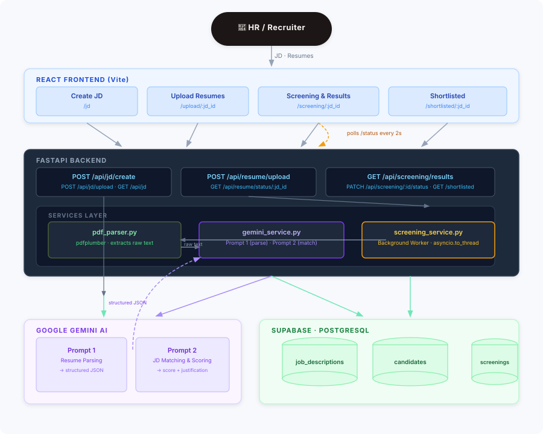

# 🧠 Smart Resume Screener
> AI-powered candidate ranking and resume screening system using Gemini AI

---

## 📌 Project Overview

Smart Resume Screener is a company/HR-side tool that allows recruiters to upload multiple candidate resumes, match them against a Job Description (JD) using Gemini AI, and get ranked results with scores and justifications — all in real time.

---

## 🎯 Who Uses This

**HR Manager / Recruiter (not the job seeker)**

- HR inputs a Job Description (typed or PDF)
- HR uploads multiple candidate resumes (up to 50 PDFs)
- System parses all resumes and scores each against the JD
- HR sees a ranked dashboard with scores, matched skills, missing skills, and justification
- HR shortlists or rejects candidates

---

## ⚙️ Tech Stack

| Layer | Technology |
|---|---|
| Backend | FastAPI (Python) |
| Frontend | React |
| Database | Supabase (PostgreSQL) |
| LLM | Gemini 3.6 Flash (Google Generative AI) |
| PDF Parsing | pdfplumber |
| HTTP Client | Axios |

---

## 🏛️ Architecture



### Key Design Decisions

| Decision | Reason |
|---|---|
| Background tasks via `asyncio.to_thread` | PDF parsing and Gemini calls are blocking I/O; offloading keeps the FastAPI event loop free |
| 4-second pacing between resumes | Gemini free-tier rate limits (429 quota); prevents batch failures |
| Two-prompt pipeline (parse → match) | Separation of concerns — parsing and scoring are independent, each with its own structured output |
| Frontend polls `/status` every 2s | Avoids WebSocket complexity while still giving live feedback |
| Raw text saved to DB before Gemini call | Allows re-screening the same resume against a different JD without re-uploading |

---


## ✅ Functional Requirements

### Core Features (Must Have)

1. **JD Input** — HR can type JD text or upload JD as PDF
2. **Bulk Resume Upload** — HR selects multiple PDFs from their laptop (up to 50)
3. **Resume Parsing** — Extract name, email, skills, experience, education from each PDF
4. **LLM Matching & Scoring** — Gemini compares each resume against JD and returns score (1–10), matched skills, missing skills, strengths, weaknesses, justification
5. **Real-time Status Tracking** — HR sees live per-resume processing status (parsing / scoring / done / failed)
6. **Ranked Results Dashboard** — All candidates ranked by score, highest first
7. **Shortlist / Reject** — HR can mark each candidate as shortlisted or rejected
8. **Shortlisted View** — Separate page showing only shortlisted candidates
9. **Export CSV** — Download shortlisted candidates as CSV

### Nice to Have
- Re-screen same resumes against a new JD without re-uploading
- Multiple JD management
- Resume history and search

---

## 🔒 Non-Functional Requirements

| Category | Requirement |
|---|---|
| Performance | Resume parsing + scoring within 10–15 seconds per resume |
| Performance | Batch of 10 resumes under 2 minutes |
| Performance | Dashboard load under 3 seconds |
| Scalability | Handle up to 100 resumes per JD |
| Reliability | If Gemini fails for one resume, others still process |
| Reliability | Parsed data saved to DB before LLM call |
| Usability | Real-time progress feedback per resume |
| Usability | Results sorted by score descending by default |
| Security | No raw PDF stored in database |
| Security | Gemini API key in `.env`, never exposed to frontend |
| Maintainability | Clean folder structure (routes, services, models separated) |

---

## 🗄️ Database Schema

### Table 1: `job_descriptions`

| Column | Type | Notes |
|---|---|---|
| id | UUID | Primary Key |
| title | TEXT | e.g. "Backend Engineer" |
| description | TEXT | JD text (typed or extracted from PDF) |
| input_type | TEXT | `typed` or `pdf` |
| created_at | TIMESTAMP | Auto |

---

### Table 2: `candidates`

| Column | Type | Notes |
|---|---|---|
| id | UUID | Primary Key |
| name | TEXT | Extracted from resume |
| email | TEXT | Extracted from resume |
| skills | JSONB | `["Python", "FastAPI", ...]` |
| experience | JSONB | `[{"role": "SDE", "company": "X", "years": 2}]` |
| education | JSONB | `{"degree": "B.Tech", "college": "VIT", "year": 2023}` |
| raw_text | TEXT | Full resume text (for re-screening) |
| file_name | TEXT | Original PDF filename |
| status | TEXT | `uploading / parsing / scoring / done / failed` |
| created_at | TIMESTAMP | Auto |

---

### Table 3: `screenings`

| Column | Type | Notes |
|---|---|---|
| id | UUID | Primary Key |
| candidate_id | UUID | FK → candidates |
| jd_id | UUID | FK → job_descriptions |
| match_score | INTEGER | 1–10 |
| matched_skills | JSONB | `["Python", "SQL"]` |
| missing_skills | JSONB | `["Kubernetes", "Docker"]` |
| justification | TEXT | Gemini's overall summary |
| strengths | TEXT | Why candidate is a good fit |
| weaknesses | TEXT | What candidate lacks |
| recommendation | TEXT | `shortlist / reject / maybe` (from Gemini) |
| status | TEXT | `pending / shortlisted / rejected` (HR decision) |
| created_at | TIMESTAMP | Auto |

---

### Relationships

```
job_descriptions ──< screenings >── candidates
      (1)              (many)            (1)

- One JD → many screenings
- One candidate → many screenings (reusable across JDs)
- Screening is the bridge table between JD and candidate
```

---

## 🔌 API Endpoints

### Job Description

| Method | Endpoint | Description |
|---|---|---|
| POST | `/api/jd/create` | Create JD from typed text |
| POST | `/api/jd/upload` | Upload JD as PDF → extract → save |
| GET | `/api/jd/all` | Get all saved JDs |
| GET | `/api/jd/{jd_id}` | Get one JD by ID |

### Resume Upload & Processing

| Method | Endpoint | Description |
|---|---|---|
| POST | `/api/resume/upload` | Upload multiple PDFs + jd_id → start processing |
| GET | `/api/resume/status/{jd_id}` | Poll → get status of all resumes for a JD |
| GET | `/api/resume/{candidate_id}` | Get one candidate's parsed data |

### Screening & Results

| Method | Endpoint | Description |
|---|---|---|
| GET | `/api/screening/results/{jd_id}` | Get all scored candidates ranked by score |
| PATCH | `/api/screening/{screening_id}/status` | HR updates status → shortlisted / rejected |
| GET | `/api/screening/shortlisted/{jd_id}` | Get only shortlisted candidates |

---

### Request / Response Examples

**POST `/api/jd/create`**
```json
Request:
{
  "title": "Backend Engineer",
  "description": "We are looking for a Python developer..."
}

Response:
{
  "jd_id": "uuid-here",
  "message": "JD created successfully"
}
```

**POST `/api/resume/upload`**
```
Request: multipart/form-data
  - files: [resume1.pdf, resume2.pdf, ...]
  - jd_id: "uuid-here"

Response:
{
  "message": "Processing started",
  "total": 50,
  "candidates": [
    {"candidate_id": "uuid-1", "file_name": "john.pdf", "status": "parsing"},
    {"candidate_id": "uuid-2", "file_name": "sara.pdf", "status": "parsing"}
  ]
}
```

**GET `/api/resume/status/{jd_id}`**
```json
{
  "total": 50,
  "done": 32,
  "failed": 1,
  "candidates": [
    {"candidate_id": "uuid-1", "file_name": "john.pdf", "status": "done"},
    {"candidate_id": "uuid-2", "file_name": "sara.pdf", "status": "scoring"},
    {"candidate_id": "uuid-3", "file_name": "bob.pdf",  "status": "failed"}
  ]
}
```

**GET `/api/screening/results/{jd_id}`**
```json
{
  "jd_title": "Backend Engineer",
  "total_screened": 50,
  "results": [
    {
      "screening_id": "uuid-here",
      "candidate_name": "John",
      "email": "john@gmail.com",
      "match_score": 9,
      "matched_skills": ["Python", "FastAPI", "PostgreSQL"],
      "missing_skills": ["Kubernetes"],
      "justification": "Strong backend experience, matches 90% of JD requirements...",
      "strengths": "3 years FastAPI experience, strong SQL skills...",
      "weaknesses": "No cloud/DevOps experience...",
      "recommendation": "shortlist",
      "status": "pending"
    }
  ]
}
```

---

## 🤖 LLM Prompt Design

### Prompt 1 — Resume Parsing

```
You are an expert HR resume parser.

Extract the following information from the resume text below and return ONLY a valid JSON object.
No explanation, no markdown, no extra text.

Resume Text:
{resume_text}

Return this exact JSON structure:
{
  "name": "full name of candidate",
  "email": "email address",
  "skills": ["skill1", "skill2", "skill3"],
  "experience": [
    {
      "role": "job title",
      "company": "company name",
      "years": 2
    }
  ],
  "education": {
    "degree": "B.Tech / M.Tech / BCA etc",
    "college": "college name",
    "year": 2023
  },
  "total_experience_years": 3
}

Rules:
- If any field is not found, use null
- skills must be a flat list of strings
- years in experience is a number not a string
- Return ONLY the JSON, nothing else
```

---

### Prompt 2 — JD Matching & Scoring

```
You are an expert technical recruiter with 10 years of experience.

Compare the candidate resume with the job description below and evaluate the fit.

Job Description:
{job_description}

Candidate Profile:
- Name: {name}
- Skills: {skills}
- Experience: {experience}
- Education: {education}
- Total Experience: {total_experience_years} years

Return ONLY a valid JSON object with no explanation, no markdown, no extra text:
{
  "match_score": 8,
  "matched_skills": ["Python", "FastAPI", "PostgreSQL"],
  "missing_skills": ["Kubernetes", "Docker"],
  "strengths": "3-4 lines about why this candidate is a good fit",
  "weaknesses": "2-3 lines about what this candidate lacks",
  "justification": "Overall 4-5 line summary explaining the score",
  "recommendation": "shortlist / reject / maybe"
}

Scoring Rules:
- 9-10: Exceptional fit, meets almost all requirements
- 7-8 : Good fit, meets most requirements
- 5-6 : Average fit, meets some requirements
- 3-4 : Below average, missing key skills
- 1-2 : Poor fit, does not match requirements

Return ONLY the JSON, nothing else.
```

---

### Processing Pipeline

```
PDF uploaded
     ↓
pdfplumber extracts raw text
     ↓
Prompt 1 → Gemini → structured candidate JSON
     ↓
Save to candidates table (status = "scoring")
     ↓
Prompt 2 → Gemini → score + justification JSON
     ↓
Save to screenings table (status = "done")
     ↓
Frontend polls /status every 2 seconds → updates UI
```

---

## 🖥️ Frontend Pages

### Page 1 — Home `/`
- App name + tagline
- "Start Screening" button → `/jd`
- "View Past JDs" button → list of saved JDs

### Page 2 — Create JD `/jd`
- Two tabs: **Type JD** / **Upload JD PDF**
- Tab 1: Job title input + textarea for JD text
- Tab 2: PDF upload dropzone
- "Save & Continue" → `/upload` with jd_id

### Page 3 — Upload Resumes `/upload`
- Shows which JD is selected
- Drag & drop or click to select multiple PDFs
- File list preview after selection
- "Start Screening" button → calls `/api/resume/upload` → redirects to `/screening/{jd_id}`

### Page 4 — Real-time Status + Results `/screening/{jd_id}`
**Section A — Live Processing** (shown while processing)
- Overall progress bar (32/50)
- Per-resume status: ✅ Done / ⏳ Scoring / ⏳ Waiting / ❌ Failed

**Section B — Results Table** (appears as candidates finish)
- Ranked by score descending
- Columns: Rank, Name, Score, Matched Skills, Status, Actions (shortlist/reject)
- Click row → expandable drawer with full justification, strengths, weaknesses

### Page 5 — Shortlisted `/shortlisted/{jd_id}`
- Only shortlisted candidates
- Card view per candidate
- Export as CSV button

---

## 📁 Folder Structure

```
smart-resume-screener/
├── backend/
│   ├── main.py
│   ├── routes/
│   │   ├── jd.py
│   │   ├── resume.py
│   │   └── screening.py
│   ├── services/
│   │   ├── pdf_parser.py       ← pdfplumber logic
│   │   ├── gemini_service.py   ← both LLM prompts
│   │   └── screening_service.py
│   ├── models/
│   │   └── schemas.py          ← Pydantic models
│   ├── db/
│   │   └── supabase_client.py
│   ├── prompts/
│   │   └── prompts.py          ← all LLM prompts in one place
│   └── .env
│
└── frontend/
    ├── src/
    │   ├── pages/
    │   │   ├── Home.jsx
    │   │   ├── CreateJD.jsx
    │   │   ├── UploadResumes.jsx
    │   │   ├── Screening.jsx
    │   │   └── Shortlisted.jsx
    │   ├── components/
    │   │   ├── JDForm.jsx
    │   │   ├── PDFDropzone.jsx
    │   │   ├── StatusTracker.jsx
    │   │   ├── ResultsTable.jsx
    │   │   ├── CandidateDrawer.jsx
    │   │   └── CandidateCard.jsx
    │   └── api/
    │       └── axios.js
    └── package.json
```

---

## 🏗️ Build Order

### Phase 1 — Backend Foundation
1. Setup FastAPI project + folder structure
2. Connect Supabase — create all 3 tables
3. Install dependencies: `pdfplumber`, `google-generativeai`, `supabase`

### Phase 2 — Core Backend Logic
4. Build `/api/jd/create` and `/api/jd/upload` endpoints
5. Build PDF text extractor using pdfplumber
6. Build Gemini resume parsing (Prompt 1)
7. Build `/api/resume/upload` endpoint — save candidates with status
8. Build Gemini JD matching (Prompt 2)
9. Build `/api/resume/status/{jd_id}` endpoint for polling
10. Build `/api/screening/results/{jd_id}` endpoint
11. Build `/api/screening/{id}/status` PATCH endpoint

### Phase 3 — Frontend
12. Setup React project + axios instance + routing
13. Build Home page
14. Build CreateJD page (typed + PDF upload tabs)
15. Build UploadResumes page (dropzone + file list)
16. Build Screening page (status tracker + results table)
17. Build Shortlisted page + CSV export

### Phase 4 — Polish
18. Error handling — failed resumes don't break batch
19. Loading states and empty states on all pages
20. README + architecture diagram
21. Demo video recording

---

## 🔑 Environment Variables

```
GEMINI_API_KEY=your_gemini_api_key
SUPABASE_URL=your_supabase_url
SUPABASE_KEY=your_supabase_anon_key
```

---

## 📦 Dependencies

### Backend
```
fastapi
uvicorn
pdfplumber
google-generativeai
supabase
python-multipart
python-dotenv
```

### Frontend
```
react
react-router-dom
axios
```
